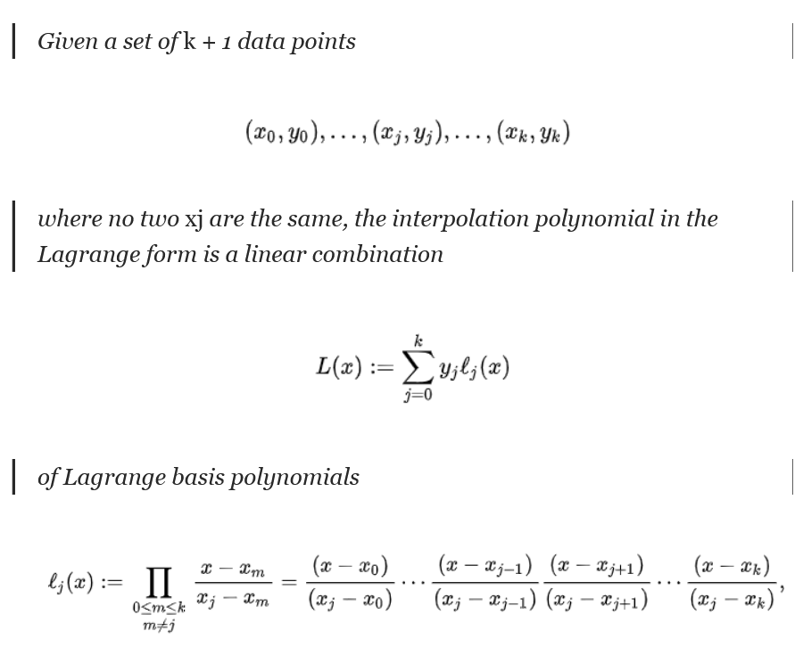

# Haskell:
- Declarative
- Lazily Evaluated = only evaluate when needed

Function Definition:
name arg1 arg2 ... arg = <expr>
``` hs
in_range min max x = x >= min && x <= max
```

## Types:
name :: <type>
```hs
x :: Integer
x = 1

in_range :: Integer -> Integer -> Integer -> Bool
```

let bindings allow you to save a value for return
```hs
in_range min max x =
    let in_lower_bound = min <= x
        in_upper_bound = max >= x
    in
    in_lower_bound && in_upper_bound
```
alternatively you can bind it with where
```hs
in_range min max x = ilb && iub
    where
        ilb = min <= x
        iub = max >= x
```

## program flow:
```hs
in_range max max x =
    if ilb then iub else False
    where
        ilb = min <=x
        iub = max >= x
```

## Recursion
```hs
fac n =
    if n <= 1 then
        1
    else
        n * fac (n-1)
```

## Guards - a different way of writing an if statement
```hs
fac n
    | n <= 1 = 1
    | otherwise = n * fac (n-1)
```

## Pattern Matching
```hs
is_zero 0 = True
is_zero _ = False
```

## Accumulators
```hs
fac n = aux n 1
    where
        aux n acc
            | n <= 1 = acc
            | otherwise = aux (n-1) (n*acc)
```

## Lists:
```hs
[1,2,3,4,5,6] :: Integer
```
list constructor:
```hs
[]
x:xs
```

## Functions:
```hs
null :: [a] -> Bool
null []
    => True
null [1,2,3,4,5]
    => False
```


### Higher Order Functions
- A Functions which takes a function as an argument
```hs
app :: (a -> b) -> a -> b
app f x = f x

add1 :: Int -> Int
add1 x = x + 1
app add1 1
-- Output: 2
```
## Anonymous Functions:
- Unnamed:
- (\\\<args> -> \<expr>)
```hs
add1 = (\x -> x + 1)
add1 1 --output: 2
(\x y z -> x+y+z) 1 2 3 -- output: 6
```
## Higher Order Anonymous functions:
```hs
app :: (a -> b) -> a -> b
app f x = f x

app (\x -> x + 1) 1
-- output: 2
```

## Map
```hs
-- map :: (a -> b) -> [a] -> [b]
map (\x -> x + 1) [1,2,3,4,5,6]
-- output [2,3,4,5,6,7]

-- list of tuples to list of their sum
map (\(x,y) -> x + y) [(1,2),(2,3),(3,4)]
-- Output: [3,5,7]
```
## Filter
```hs
-- filter :: (a -> Bool) -> [a] -> [a]
filter (\x -> x > 2) [1,2,3,4,5]
--output: [3,4,5]

-- Remove tuples which have the same values
filter (\(x,y) -> x /= y) [(1,2),(2,2)]
-- output [(1,2)]
```
## Partial Function Application - Currying
Making sure functions have only one argument and return functions which take another.
```hs
-- f :: a -> b -> c -> d
-- f :: a -> (b -> (c -> d))
add :: Int -> Int -> Int
add x y = x + y
add x = (\y -> x + y)
add = (\x -> (\y -> x + y))

-- doubling list via partial function application
doubleList = map (\x -> 2*x)
```
## Function Composition:
Joining functions
```hs
(.) :: (b -> c) -> (a -> b) -> a -> c
descSort = reverse . sort
map2D = map . map
```

We can rewrite this in many ways:
```hs
map2D :: (a -> b) -> [[a]] -> [[b]]
map2D = map . map

map2D = (\f1 xs -> map f1 xs) . (\f2 ys -> map f2 ys)
map2D = (\x -> (\f1 xs -> map f1 xs) ((\f2 ys -> map f2 ys) x))
map2D x = (\f1 xs -> map f1 xs) ((\f2 ys -> map f2 ys) x) 
map2D x = (\f1 xs -> map f1 xs) (\ys -> map x ys)
map2D x = (\xs -> map (\ys -> map x ys) xs)
map2D f xs = map (\ys -> map f ys) xs
```

## Dollar Sign
Takes a function and a value and applies the function to the value.
Used to clean up code
```hs
($) :: (a -> b) -> a -> b

f xs = map (\x -> x + 1) (filter (\x -> x> 1 ) xs)
f xs = map (\x -> x + 1) $ filter (\x -> x> 1 ) xs
```
Allows us to remove some parentheses

## . vs $
The Infix operator ($) is used to omit brackets. It applies the function on its left to the value on its right:
```hs
putStrLn (show (1 + 1))
putStrLn $ show (1 + 1)
putStrLn $ show $ 1 + 1
```
The dot (.) is used to chain functions:
```hs
putStrLn (show (1 + 1))
(putStrLn . show) (1 + 1)
putStrLn . show $ 1 + 1
```
mainly used to make code neater.


# Folding (Reduce)
We can fold left or right.
```hs
foldr :: (a -> b -> b) -> b -> [a] -> b
```
Foldr takes a function as it's argument. The function itself takes two arguments an argument of type a and an argument of type b and returns a type b. Then foldr gets an argument b and a list a and returns a type b

```hs
foldr (⊕) a [x1, x2,..., xn] = x1 ⊕ x2 ⊕ ... ⊕ xn ⊕ a 
```
We have an operator in this case XOR (⊕) foldr takes in a list and an accumulator or starting value.
Foldr is the combination of all values with the binary function and it's starting value. Kinda like reduce.

**Example: Sum of an Array**
```hs
foldr (+) 0 [1,2,...,n] = 1 + 2 + ... + n + 0
```
**Building the Functions:**
```hs
sum = foldr (+) 0
and = foldr (&&) True
or = foldr (||) False
```

**Reducing with a custom function:**
```hs
-- foldr (\elem acc -> <term>) <start_acc> <list>
-- Count -> How often an element appears in a list
count e = foldr (\x acc -> if e == x then acc+1 else acc) 0

-- Check if all are equal to an element
isAll e = foldr (\x -> (&&) $ e == x) True
-- if we have an acc then if x is same as e for each element
isAll e = foldr (\x acc -> e == x && acc) True
```

**A lot of functions which exist in lists can be built by folds:**
E.G.
```hs
length = foldr (\x -> (+) 1) 0
map f = foldr ((:) . f) []

-- Ignore the first argument with const:
length = foldr (const $ (+) 1) 0
```
**Folding Direction**
Fold Left: the accumulator and element arguments are switched
```hs
foldr (\elem acc -> <term>) <start_acc> <list>
foldl (\acc elem -> <term>) <start_acc> <list>
```
The Foldr function treats the elements from right to left, last element build to first
In Foldl the elements are treated from left to right, start with first and move to end

You can fold other data types too!!
**Folding Trees**
- In Order = foldl
- Post-Order 
- Pre-Order

Whether you use foldl or foldr is purely based on preference.

# Custom Datatypes
```hs
data Name = Constructor1 <arg> | Constructor2 <arg>
data Color = Red | Orange | Yellow | Green | Blue | Magenta
data PeaNum = Succ PeaNum | Zero -- Recursive data types are useful

data Calculation = Add Int Int | Sub Int Int | Mul Int Int | Div Int Int
calc :: Calculation -> Int
calc (Add x y) = x+y
calc (Sub x y) = x-y
calc (Mul x y) = x*y
calc (Div x y) = div x y
```

**A Tree**
```hs
data Tree a = Leaf | Node (Tree a) a (Tree a)
tree :: Tree Int
tree = Node (Node Leaf 1 Leaf) 2 (Node (Node Leaf 3 Leaf) 4 Leaf)
```

## Problem 

```hs
lagrange :: [(Float, Float)] -> Float -> Float 
lagrange xs x = foldl (\acc (xj,y) -> acc + (y * l xj)) 0 
    xs 
        where
            l xj = foldl (
                \acc (xk, _) ->
                    if xj == xk then
                        acc
                    else
                        acc * ((x-xk)/(xj-xk))
                ) 1 xs    


```

# Records
Records let up make data types which have named fields:
```hs
data Person = Person {name :: String,
                      age :: Int}
-- From there the following functions are automatically generated
name :: Person -> String
age :: Person -> Int

-- We can now:
greet :: Person -> [Char]
greet person = "Hi " ++ name person
-- or using pattern matching
greet (Person name _) = "Hi " ++ name
```

## Useful Algorithms:
**words and unwords**
```hs
let mystr = "Hello this is a is long sentence"
words mystr 
-- ["Hello", "this", "is", "a", "is", "long", "sentence"]
let splitwords = words mystr
take 4 $ splitwords
-- ["Hello", "this", "is", "a"]
unwords . take 4 $ words mystr
-- "Hello this is a"
```
**signum and product**
*signum* returns the sign of a number. -1 if negative +1 if positive and 0 if 0
**product** = `foldr (*) 1`
```hs
let x = [-1,-2,-3,3,2,1,0]
signum (-10)
-- -1
map signum x
-- [-1,-1,-1,1,1,1,0]
product $ map signum x
-- 0
```

## Maybe
**Maybe** is a type which can be either `Nothing` or `Just`
```hs
data Maybe a = Nothing | Just a
```
Maybe allows us to do error handling:
```hs
safediv :: Integral a => a -> a -> Maybe a
safediv a b = if b == 0 then Nothing else Just $ a `div` b
-- safediv 10 2 = Just 5
-- safediv 10 0 = Nothing
```
Maybe Data Type functions
```hs
import Data.Maybe

isJust :: Maybe a -> Bool
isNothing :: Maybe a -> Bool
fromJust :: Maybe a -> a

-- function with default value with partial function application
fromMaybe :: a -> Maybe a -> a
fromMaybe 3.1415 (Nothing) 
--    => 3.1415
fromMaybe 3.1415 (Just 3.1)
--   => 3.1
```

## IO
**IO** is a type which represents the input and output of a program.
```hs
hw = putStrLn "Hello World"
hw :: IO ()
```
IO is an action. It can be performed by calling the function hw.
Functions in Haskell have to be pure so it couldn't work with the environment.

### getLine action
```hs
getLine :: IO String
greet :: IO ()
greet = do
    putStrLn "What is your name?"
    name <- getLine
    putStrLn ("Hello " ++ name ++ ".")
```
greet is an IO actions which prints "What is your name?" and then waits for the user to input a name.
You technically could use `unsafePerformIO` to get the input but it's not recommended.